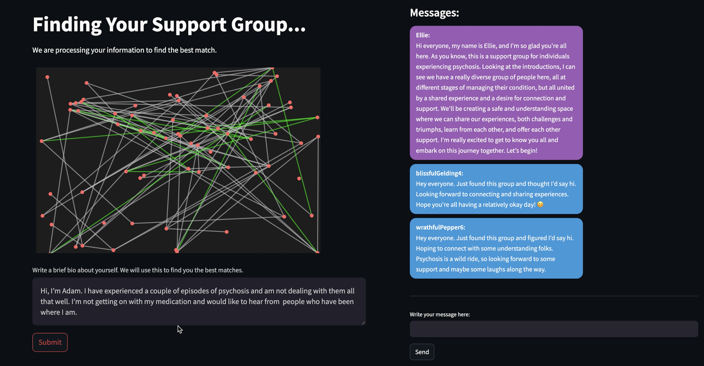

# RoboSmile: Intervention

### Repo for the RoboSmile team's MEXA mental health AI hackathon project 2: SafeCircles. We want to create hyper-personalised support groups using large language models to match and mediate conversations between people with similar mental health issues. 

Members (in alphabetical order):
- Limou Dembele
- Adam Harris
- Clàudia Llinares
- María Navas-Loro
- Luis Torrao

------------------------

### This codebase has two main parts:

1) A notebook for generating an artificial dataset of users, and generating embeddings of their bios.

2) A streamlit app that allows a user to sign up, have their bio embedded and matched with those most similar, and a basic conversation with the synthetic users and Ellie, the LLM mediator. 

https://safecircles.onrender.com/

